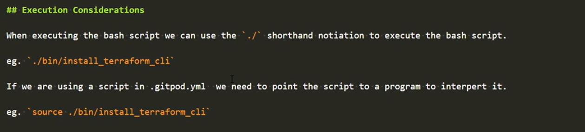
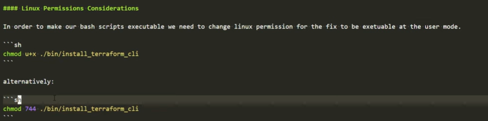
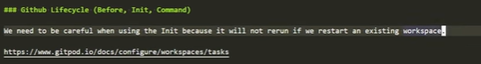
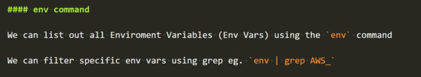
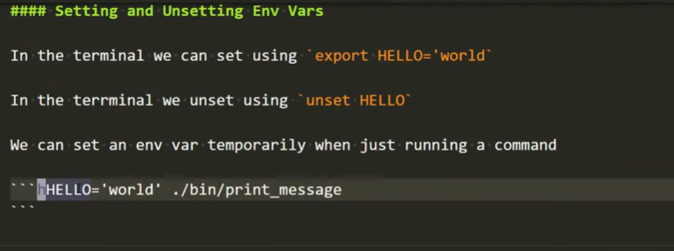
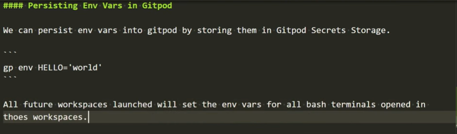
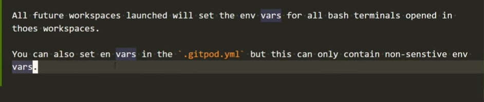

# Terraform Beginner Bootcamp 2023

```
lol
hallo
VSCode usefull things:
multiple lines ALT+SHIFT+(arrow)
```
## Semantic Versioning :mage:

This project is going utilize semantic versioning for its tagging.
[semver.org](https://semver.org/)

The general format:

**MAJOR.MINOR.PATCH**, eg. `1.0.1`

- **MAJOR** version when you make incompatible API changes
- **MINOR** version when you add functionality in a backward compatible manner
- **PATCH** version when you make backward compatible bug fixes

## Install the Terraform CLI

### Considerations with the Terraform CLI changes
The Terraform CLI installation instructions have changed due to gpg keyring changes. So we needed refer to the latest install CLI instructions via Terraform Documentation and change the scripting for install.

[Install Terraform CLI](https://developer.hashicorp.com/terraform/tutorials/aws-get-started/install-cli)

### Considerations for Linux Distribution

This project is built against Ubuntu.
Please consider checking your Linux Distribution and change accordingly to distribution needs.

[How to Chech OS Version in Linux](https://www.cyberciti.biz/faq/how-to-check-os-version-in-linux-command-line/)


```
$cat /etc/os-release

PRETTY_NAME="Ubuntu 22.04.3 LTS"
NAME="Ubuntu"
VERSION_ID="22.04"
VERSION="22.04.3 LTS (Jammy Jellyfish)"
VERSION_CODENAME=jammy
ID=ubuntu
ID_LIKE=debian
HOME_URL="https://www.ubuntu.com/"
SUPPORT_URL="https://help.ubuntu.com/"
BUG_REPORT_URL="https://bugs.launchpad.net/ubuntu/"
PRIVACY_POLICY_URL="https://www.ubuntu.com/legal/terms-and-policies/privacy-policy"
UBUNTU_CODENAME=jammy
```

### Refactoring into Bash Scripts

While fixing the Terraform CLI gpg depreciation issues we notice that bash scripts steps were a considerable amount more code. So we decided to create a bash script to install the Terraform CLI.

This bash script is located here: [./bin/install_terraform_cli]()

- This will keep the Gitpod Task File ([.gitpod.yml](.gitpod.yml)) tidy.
- This allow us an easier to debug and execute manually Terraform CLI install
- This will allow better portablity for other projects that need to install Terraform CLI.

#### Shebang

A Shebang (prounced Sha-bang) tells the bash script what program that will interpet the script. eg. `#!/bin/bash`

ChatGpt recommended this format for bash : `#!/usr/bin/env bash`

- for portability for different OS distributions
- will seach the users's PATH for the bash executable

When executing the bash script we can use the `./` shorthand notiation to execute the bash script.

https://hu.wikipedia.org/wiki/Shebang_(UNIX)

## Execution Considerations



#### Linux Permissions Considuration



https://en.wikipedia.org/wiki/Chmod

### Github lifecycle (before, Init, Command)



https://www.gitpod.io/docs/configure/workspaces/tasks

### Working Env Vars

#### env command



#### Setting and Unsetting Env Vars



```sh
HELLO= 'world' ./bin/print_message
```
Within a bash script we can set env without writing export eg. 

```sh
#!/usr/bin/env bash

HELLO='word'

echo $HELLO
```

#### Printing Vars

We can print an env var using echo eg. `echo $HELLO`

#### Scoping of Env Vars

WHen you open up new bash terminals in VSCode it will not be aware of env vars that you have set in another window.

If you want to Env Vars to persist across all future bash terminals that are open you need to set env vars in your bash profile eg. `.bash:profile`

#### Persisting Env Vars in Gitpod





### AWS CLI Installation

AWS CLI is installed for the project via the bash script [`./bin/install_aws_cli`](./bin/install_aws_cli)

[Getting started Install (AWS CLI)](https://docs.aws.amazon.com/cli/latest/userguide/getting-started-install.html)
[AWS CLI Env Vars](https://docs.aws.amazon.com/cli/latest/userguide/cli-configure-envvars.html)

We can check our AWS credentials is configured correctly by running the following AWS CLI command:
```sh
aws sts get-caller-identity
```

If it is succesful you should see a json payload return that looks like this:

```json
{
    "UserId": "AIDAWSADTPNQFITAAQWER8",
    "Account": "123456789012",
    "Arn": "arn:aws:iam::123456789012:user/
    terraform-beginner-bootcamp"
}
```

We'll need to generate AWS CL credits from IAM User in order to the user AWS CLI.

```
# Don't know why but the AWS_SECRET_ACCESS_KEY always the same as the AWS_ACCESS_KEY_ID.
# need to [unset AWS_SECRET_ACCESS_KEY] and export AWS_SECRET_ACCESS_KEY='...' 
# Solved the gitpod variables needed to be changed.

echo $AWS_ACCESS_KEY_ID
echo $AWS_SECRET_ACCESS_KEY
```

## Terraform Basics

### Terraform Registry

Terraform source their providers and modules from the Terraform registry which located at [registry.terraform.io](https://registry.terraform.io/)

- **Providers** is an interfaces to API that will allow to creat resources in terraform.
- **Modules** are a way to make large amount of terraform code modular, portable and sharable.

[Random Terraform Provider](https://registry.terraform.io/providers/hashicorp/random)

### Terraform Console 

We can see a list of all the terraform commands by simply typing `terraform`  

#### Terraform Init

At the start of a new terraform project we will run `terraform init` to download the binaries for the terraform providers that we'll use in this project.

#### Terraform Plan

`terraform plan`

This will generate out a changeset,about the state of our infrasturcture and what will be changed.

We can output this changeset ie. "plan" to be passed to an apply,but often you can just ignore outputting.

#### Terraform Apply

`terraform apply`

This will run a plan and pass the changeset to be execute by terraform. Apply should prompt yes or no.

If we want to automatically approve an apply we can provide the auto approve flag eg. `terrraform apply --auto-approve`

### Terraform Lock Files

`.terraform.lock.hcl` contains the locked versioning for the providers or modules that should be used with this project.

The Terraform Lock FIles should be committed to your Version Control System (VSC) eg. Github

### Terraform State Files

`.terraform.tfstate` contain information about the current state of your infrastucture.

This file **should not be commited** to your VCS.

This file can contain sensitive data.

If you lose this file, you lose knowing the state of your infrastructure.

`.terraform.tfstate.backup` is the previous state file state.

### Terraform Directory

`.terraform` directory contains binaries of terraform providers.